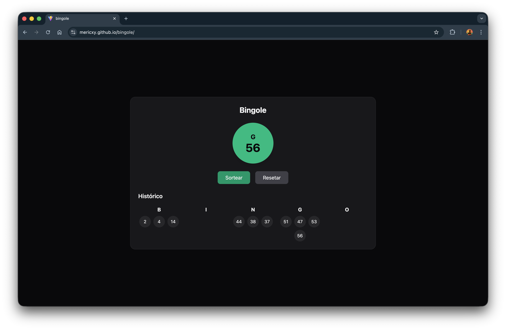

# Bingole (Bingo)



Aplicação web simples de **sorteio de bingo**, desenvolvida em **React + Vite**, utilizando **JavaScript** e **Tailwind CSS**.  
O projeto foi criado **exclusivamente como treinamento de frontend**, com foco em estado, organização de UI e experiência do usuário.

🔗 **Acesse a aplicação:**  
https://mericxy.github.io/bingole/

---

## 📌 Sobre o projeto

O Bingole simula um sorteio básico de bingo, permitindo gerar números aleatórios e acompanhar o histórico dos números já sorteados.

Nesta versão mais recente, foram feitas melhorias visuais e de usabilidade para tornar a experiência mais clara e fluida.

---

## ✨ Funcionalidades

- 🎲 Sorteio aleatório de números
- 📜 Histórico completo dos números sorteados
- 🔢 Organização do histórico em colunas ordenadas de forma crescente
- ⭐ Destaque visual para os **dois últimos números sorteados**
- ⏳ Tela de loading ao acionar o sorteio, melhorando o feedback ao usuário
- 📱 Layout responsivo

---

## 🛠️ Tecnologias utilizadas

- **React**
- **Vite**
- **JavaScript (ES6+)**
- **Tailwind CSS**
- **GitHub Pages** (deploy)

---

## 🚀 Deploy

O projeto está hospedado no **GitHub Pages** e possui um fluxo de deploy automatizado via **GitHub Actions**, acionado por **tags de versão** seguindo versionamento semântico.

Exemplo:
```bash
v0.1.0
v0.1.1
```

## 🎯 Objetivo

- Este projeto não tem fins comerciais e não foi desenvolvido como produto final, mas sim como:

- Treinamento de frontend

- Prática de organização de componentes

- Exercício de UI/UX

- Base para aprendizado de automação e deploy

## 📄 Licença

Projeto de uso livre para fins educacionais.